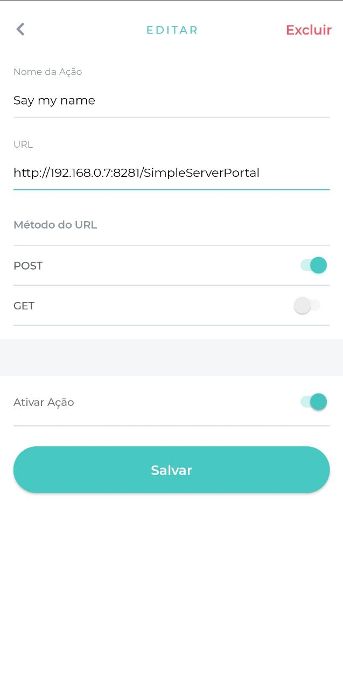

# simple-key-action
Este é um simples programa para testar uma ação utilizando o KeyApp.
#### Primeiros comandos
Instale as depêndencias
```
npm install
```
E inicie o projeto com:
```
node app
```
##### No KeyApp...
Crie uma ação em seu portal com o Method POST ou GET e habilite no seu device. No campo URL copie o endereço de URL que está mostrando no seu terminal. É necessário que seu dispositivo esteja na mesma rede que está rodando esse programa (Mesmo WI-FI :P).

##### No navegador
Acesse a webpage http://192.168.0.7:8281 para visualizar a tabela. Não esqueça de clicar em ```Update Table``` pra atualizar.
##### P.s.
Recomenda-se utilizar o método POST para um melhor feedback de quem acessou aquele portal.
##### Limpando os dados
Caso queira limpar os dados, apague o arquivo ```data.json```.
